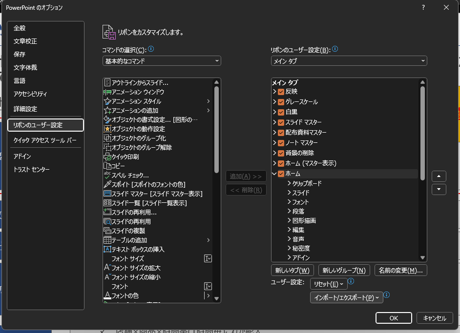
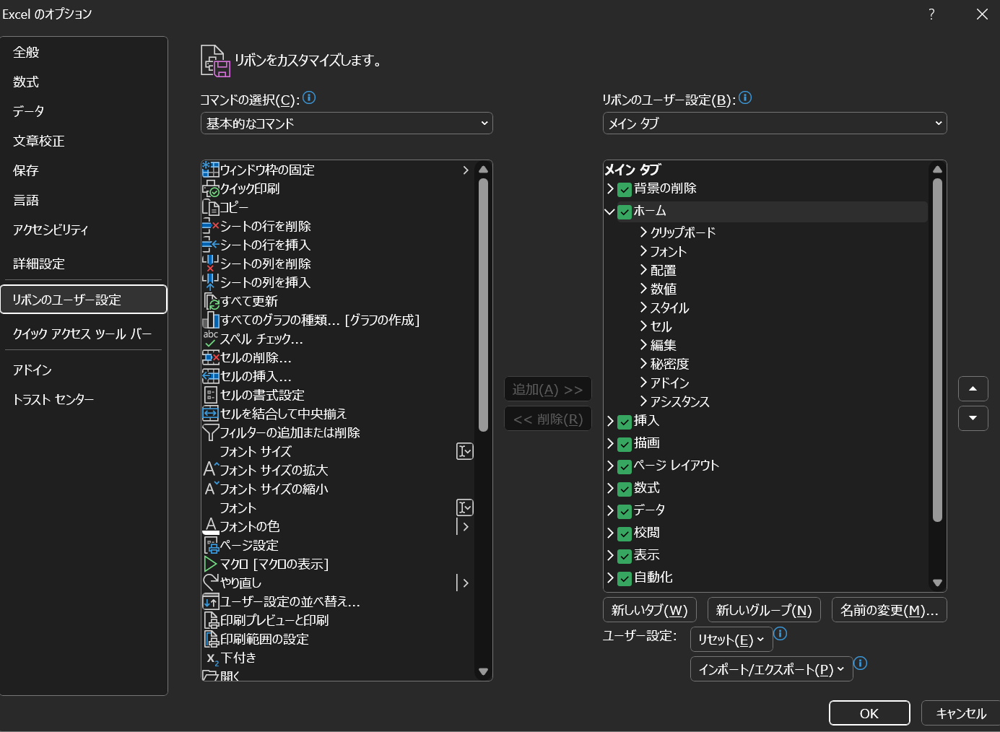

# dotfiles

## Overview
俺の俺による俺のための設定ファイルセットです。インストールもするやつ

## Supported OS（WIP）
- Windows
- Ubuntu
    - WSL2 Ubuntu 含む
- ChromeOS Linux([Debian](https://support.google.com/chromebook/answer/9145439))

## Installation（WIP）

### Windows
1. Download

   ```bash
   git clone https://github.com/allllllllez/dotfiles.git
   cd dotfiles
   ```

1. Install
   コマンドプロンプト（**管理者として実行**で起動すること[^1]）で次を実行：

   ```command
   scripts/windows/install.bat
   ```

1. その他設定
    1. PowerPointリボンのカスタマイズ
      - ホームから「オプション」> 「リボンのユーザー設定」
         - <details>
           <summary>画像</summary>

           
           </details>
    1. PowerPoint・Excel リボンのカスタマイズ
      - ホームから「オプション」> 「リボンのユーザー設定」
         - <details>
           <summary>画像</summary>

           
           </details>

1. ログ

<details>

```log
$ winget.exe list | grep winget
NVM for Windows 1.2.2                   CoreyButler.NVMforWindows               1.2.2                            winget
Docker Desktop                          Docker.DockerDesktop                    4.42.1                           winget
Git                                     Git.Git                                 2.50.0                           winget
Microsoft 365 Apps for enterprise - en… Microsoft.Office                        16.0.18827.20164                 winget
Microsoft 365 Apps for enterprise - ja… Microsoft.Office                        16.0.18827.20164                 winget
Microsoft OneDrive                      Microsoft.OneDrive                      25.095.0518.0002                 winget
Unity 6000.0.51f1                       Unity.Unity.6000                        6000.0.51f1                      winget
Microsoft Visual C++ 2010  x64 Redistr… Microsoft.VCRedist.2010.x64             10.0.40219                       winget
Google Chrome                           Google.Chrome                           131.0.6778.86     137.0.7151.120 winget
AWS Command Line Interface v2           Amazon.AWSCLI                           2.27.40.0                        winget
Google Cloud SDK                        Google.CloudSDK                         Unknown           527.0.0        winget
Microsoft Edge                          Microsoft.Edge                          137.0.3296.93                    winget
OBS Studio                              OBSProject.OBSStudio                    31.0.3                           winget
Microsoft Visual C++ 2013 Redistributa… Microsoft.VCRedist.2013.x64             12.0.30501.0      12.0.40664.0   winget
Microsoft Windows Desktop Runtime - 6.… Microsoft.DotNet.DesktopRuntime.6       6.0.36                           winget
Microsoft Visual C++ 2015-2019 Redistr… Microsoft.VCRedist.2015+.x86            14.28.29914.0     14.44.35211.0  winget
Chrome Remote Desktop Host              Google.ChromeRemoteDesktopHost          138.0.7204.6                     winget
Microsoft Visual C++ 2015-2022 Redistr… Microsoft.VCRedist.2015+.x64            14.42.34433.0     14.44.35211.0  winget
Epic Games Launcher                     EpicGames.EpicGamesLauncher             1.3.149.0                        winget
Microsoft Windows Desktop Runtime - 8.… Microsoft.DotNet.DesktopRuntime.8       8.0.16            8.0.17         winget
Obsidian                                Obsidian.Obsidian                       1.8.10                           winget
jq                                      jqlang.jq                               1.8.0                            winget
fzf                                     junegunn.fzf                            0.62.0                           winget
Ollama version 0.9.2                    Ollama.Ollama                           0.9.2                            winget
Microsoft Visual Studio Code (User)     Microsoft.VisualStudioCode              1.101.1                          winget
Ubuntu                                  Canonical.Ubuntu                        2404.1.68.0                      winget
Microsoft Teams                         Microsoft.Teams                         25153.1010.3727.…                winget
アプリ インストーラー                   Microsoft.AppInstaller                  1.25.390.0                       winget
Microsoft.UI.Xaml.2.7                   Microsoft.UI.Xaml.2.7                   7.2409.9001.0                    winget
Microsoft.UI.Xaml.2.7                   Microsoft.UI.Xaml.2.7                   7.2409.9001.0                    winget
Microsoft.UI.Xaml.2.8                   Microsoft.UI.Xaml.2.8                   8.2501.31001.0                   winget
Microsoft.UI.Xaml.2.8                   Microsoft.UI.Xaml.2.8                   8.2501.31001.0                   winget
Microsoft Visual C++ 2015 UWP Desktop … Microsoft.VCLibs.Desktop.14             14.0.33728.0                     winget
Microsoft Visual C++ 2015 UWP Desktop … Microsoft.VCLibs.Desktop.14             14.0.33728.0                     winget
Windows ターミナル                      Microsoft.WindowsTerminal               1.22.11141.0                     winget
Windows Package Manager Source (winget… MSIX\Microsoft.Winget.Source_2025.623.… 2025.623.652.29   
```

</details>

[^1]: mklink を実行するために必要。

### Linux（WSL）
1. Download
   [Windows](#windows) の手順と同様 [^2]

1. Install

   ```bash session
   ./install.sh
   ```

2. neovim plugin install

   ```bash
   vi --headless -c 'Lazy! sync' -c 'qall'
   ```

[^2]: Win・Linux 共通でもいいっちゃいいけど。。。

1. Enjoy👍

